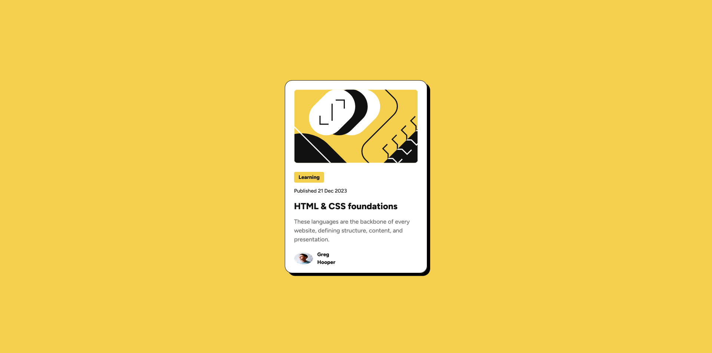

# Frontend Mentor - Blog preview card solution

This is a solution to the [Blog preview card challenge on Frontend Mentor](https://www.frontendmentor.io/challenges/blog-preview-card-ckPaj01IcS). Frontend Mentor challenges help you improve your coding skills by building realistic projects. 

## Table of contents

- [Overview](#overview)
  - [The challenge](#the-challenge)
  - [Screenshot](#screenshot)
  - [Links](#links)
  - [Built with](#built-with)
  - [What I learned](#what-i-learned)
  - [Useful resources](#useful-resources)
- [Author](#author)

## Overview

This simple blog preview card is built using HTML and CSS. It has hover effects and it is also responsive to all screen sizes.

### The challenge

Users should be able to:

- See hover and focus states for all interactive elements on the page 

### Screenshot



### Links

- Solution URL: https://www.frontendmentor.io/solutions/responsive-blog-preview-card-using-html-and-css-TjYfrShit2
- Live Site URL: https://schindlerdumagat.github.io/blog-preview-card/

### Built with

- Semantic HTML5 markup
- CSS custom properties
- CSS clamp function
- Flexbox

### What I learned

One thing I have learned is that you can use CSS clamp function to create responsive websites.
I have also learned how to apply hover effects on an element and also use the transition property to apply some transition animation.

```
.blog-content h1 {
  font-size: clamp(20px, 5vw, 24px);
  font-weight: 800;
  transition: 0.7s ;
}

article:hover {
    box-shadow: 16px 16px black;
  }
```

### Useful resources

- [MDN](https://developer.mozilla.org/en-US/docs/Web/CSS/clamp) - This helped me create a responsive website without using media queries.

## Author

- Website - [Schindler C. Dumagat](https://schindlerdumagat.github.io/webportfolio/)
- Frontend Mentor - [@schindlerdumagat](https://www.frontendmentor.io/profile/schindlerdumagat)
- LinkedIn - [@schindlerdumagat](https://www.linkedin.com/in/schindler-dumagat-015238230/)
